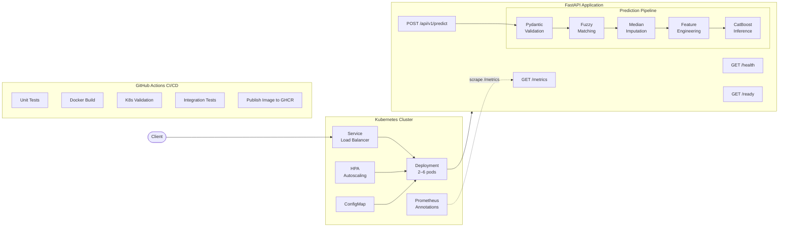
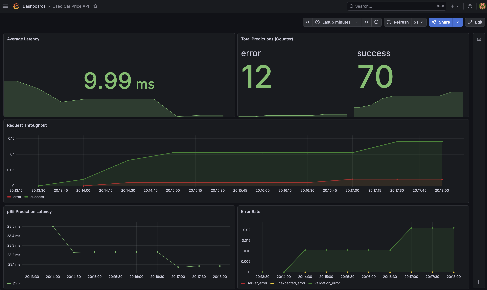

# Used Car Price Prediction API

**From notebook to production** · A CatBoost model served via FastAPI with Docker, Kubernetes, and CI/CD

**Author:** Erin Weiss  
[Portfolio](https://erin-weiss.github.io/index.html) | [LinkedIn](https://www.linkedin.com/in/erinweiss3/) | [GitHub](https://github.com/Erin-Weiss)

[](https://github.com/Erin-Weiss/used-car-price-api/actions)
[](https://python.org)
[](https://fastapi.tiangolo.com)
[](https://catboost.ai)
[](https://www.docker.com)
[](https://kubernetes.io)
[](https://prometheus.io)
[](https://grafana.com)
[](https://github.com/Erin-Weiss/used-car-price-api/pkgs/container/used-car-price-api)

[View the Full Interactive Report](https://erin-weiss.github.io/articles/API-Used-Car-Price.html) | [Live GitHub Page](https://erin-weiss.github.io/used-car-price-api/)

---

## Overview

This is **Part 2** of a two-part project. [Part 1](https://github.com/Erin-Weiss/used-car-price-prediction) explored the data science: EDA, feature engineering, and model selection across Ridge, CatBoost, and FT-Transformer architectures. The final CatBoost model predicts within ~$1,300 of the true listing price at the median across 29 manufacturers and 5,600+ model variants.

**This repo takes that model from a notebook artifact to a production-ready API**, covering everything a real deployment needs: request validation, fuzzy matching of user inputs, median imputation of optional fields, containerization, orchestration, health monitoring, and automated CI/CD.



---

## Why This Project Exists

Used-car pricing is a high-volume, high-stakes problem. Dealerships, online marketplaces, and auto lenders need fast, accurate price estimates to set competitive listings, flag underpriced inventory, and underwrite loans. A model sitting in a notebook doesn't solve any of those problems. It needs an API that's reliable, observable, and deployable.

This project demonstrates the full ML engineering lifecycle: taking a trained model and building the production infrastructure around it.

---

## Architecture

```
Client Request
    │
    ▼
┌─────────────────────────────────────────────────────────────┐
│  FastAPI Application                                        │
│                                                             │
│  POST /api/v1/predict                                       │
│    ├── Pydantic validation (18 vehicle attributes)          │
│    ├── Fuzzy matching against training vocabularies         │
│    ├── Median imputation for optional fields                │
│    ├── Feature engineering pipeline (shared with training)  │
│    ├── CatBoost inference (log1p → expm1 inverse transform) │
│    └── Structured JSON response with warnings + input echo  │
│                                                             │
│  GET  /health ──── Kubernetes liveness probe                │
│  GET  /ready ───── Kubernetes readiness + startup probe     │
│  GET  /metrics ─── Prometheus-compatible observability      │
└─────────────────────────────────────────────────────────────┘
    │
    ▼
┌─────────────────────────────────────────────────────────────┐
│  Kubernetes Cluster                                         │
│    ├── Deployment (2–6 pods, rolling updates)               │
│    ├── Service (load balancing)                             │
│    ├── HPA (CPU-based autoscaling)                          │
│    ├── ConfigMap (environment configuration)                │
│    └── Prometheus annotations (auto-discovery scraping)     │
└─────────────────────────────────────────────────────────────┘
```

---

## Key Engineering Decisions

**Shared feature pipeline.** The same `pipeline.py` that transforms training data also runs at inference time. This eliminates training-serving skew, the most common silent failure mode in production ML systems.

**Fuzzy matching for resilient inputs.** Manufacturer, model, drivetrain, and fuel type are matched against the training vocabulary using `difflib.SequenceMatcher`. A user who submits `"Toyata"` gets auto-corrected to `"toyota"` with a warning in the response, rather than a silent bad prediction or a hard rejection. Model names are matched conditionally against the corrected manufacturer's catalog of 5,600+ variants.

**Optional fields with median imputation.** Listing metadata fields (`mpg`, `price_drop`, `seller_rating`, `driver_rating`, `driver_reviews_num`) are optional. When omitted, they're filled with training-set medians from `numeric_medians.json`. This means a user can submit just 13 required fields and still get a reasonable prediction.

**Pydantic validation with domain constraints.** Every request is validated against real-world bounds (year 1983–2025, mileage ≥ 0, binary flags 0/1, etc.) before reaching the model. Unknown fields are rejected via `extra="forbid"` to catch typos like `"manufacurer"`. Invalid inputs get clear error messages, not garbage predictions.

**Startup vs. readiness vs. liveness probes.** CatBoost model loading takes several seconds. The startup probe gives the container up to ~125s to load before Kubernetes considers it failed, while the readiness probe gates traffic until the model is actually in memory. The liveness probe is a simple process-alive check.

**Thread-safe runtime state.** The model and JSON artifacts are loaded once at startup and shared immutably across all incoming requests. A double-checked lock in `model.py` ensures that even if multiple requests arrive during startup, the model is loaded exactly once, with no race conditions or duplicated work.

---

## Observability

The API exposes Prometheus-compatible metrics at `GET /metrics` for production monitoring. Three custom metrics track what matters for ML model serving:

| Metric | Type | What It Tracks |
|---|---|---|
| `prediction_requests_total` | Counter | Total predictions served, labeled by status (success/error) |
| `prediction_latency_seconds` | Histogram | Prediction duration distribution with percentile buckets |
| `prediction_errors_total` | Counter | Failed predictions, labeled by error type (validation/server/unexpected) |

Metrics are collected via ASGI middleware that wraps the prediction endpoint, so the model inference code itself is untouched. Kubernetes deployment manifests include Prometheus scraping annotations (`prometheus.io/scrape`, `prometheus.io/port`, `prometheus.io/path`) for automatic service discovery in production clusters.

```bash
# View raw metrics
curl http://localhost:8000/metrics
```
A custom Grafana dashboard visualizes these metrics in real time. The dashboard JSON is included at [`docs/grafana-dashboard.json`](docs/grafana-dashboard.json) for one-click import.

<p align="center">
  
  <br>
  <em>Grafana dashboard running on minikube: latency, throughput, and error monitoring across 2 pods</em>
</p>

---

## API Reference

### Required Fields (13)

These describe the vehicle itself and must always be provided:

| Field | Type | Description | Example |
|---|---|---|---|
| `manufacturer` | `string` | Vehicle make (fuzzy-matched) | `"toyota"` |
| `model` | `string` | Model name (fuzzy-matched against manufacturer's catalog) | `"camry le"` |
| `year` | `int` | Model year (1983–2025) | `2020` |
| `mileage` | `float` | Odometer reading in miles (≥ 0) | `35000` |
| `engine` | `string` | Engine description (parsed for liters, cylinders, layout, turbo) | `"2.5l i4 dohc 16v"` |
| `transmission` | `string` | Transmission description (parsed for type and gear count) | `"8 speed automatic"` |
| `drivetrain` | `string` | Drivetrain type (fuzzy-matched); accepts abbreviations or full names such as `fwd`, `rwd`, `awd`, `4wd`, `front wheel drive`, `rear wheel drive`, `all wheel drive`, `four wheel drive` | `"fwd"` |
| `fuel_type` | `string` | Fuel type (fuzzy-matched): `gasoline`, `diesel`, `hybrid`, `electric` | `"gasoline"` |
| `exterior_color` | `string` | Exterior color as listed (mapped to base color internally) | `"silver metallic"` |
| `interior_color` | `string` | Interior color as listed (mapped to base color internally) | `"black leather"` |
| `accidents_or_damage` | `int` | `1` if accidents or damage reported, `0` otherwise | `0` |
| `one_owner` | `int` | `1` if single-owner vehicle, `0` otherwise | `1` |
| `personal_use_only` | `int` | `1` if personal use only, `0` otherwise | `1` |

> **Note on `year`:** The training data ends in early 2023, so the model's reference year is 2023. Vehicles with a model year after 2023 are treated as brand new (age 0) for the purpose of computing age-derived features like `age` and `mileage_per_year`. This means a 2024 and a 2025 car receive identical age features, which is not perfect but far better than feeding a negative age into the model.

### Optional Fields (5)

Listing metadata. Omit any or all, and training-set medians are substituted:

| Field | Type | Default | Description |
|---|---|---|---|
| `mpg` | `string`, `number`, or `null` | Median `mpg_avg` | MPG as a range string (`"28-32"`), a single string (`"30"`), or a number (`30`). Ranges are averaged internally. |
| `price_drop` | `float` or `null` | Median | Price drop amount in dollars (≥ 0) |
| `seller_rating` | `float` or `null` | Median | Seller rating (typically 1.0–5.0) |
| `driver_rating` | `float` or `null` | Median | Consumer rating (typically 1.0–5.0) |
| `driver_reviews_num` | `float` or `null` | Median | Number of consumer reviews (≥ 0) |

### What the API Handles for You

The API does significant preprocessing so callers don't have to worry about exact formatting:

- **Typos in manufacturer/model** → fuzzy-corrected with a warning (e.g., `"Toyata"` → `"toyota"`)
- **Unknown drivetrain or fuel type** → fuzzy-corrected if a close match exists
- **Omitted optional fields** → filled with training-set medians
- **Color descriptions** → mapped to base colors internally (`"silver metallic"` → `"gray"`)
- **Engine strings** → parsed for displacement, cylinder count, layout, and turbo/hybrid flags
- **Transmission strings** → parsed for type (`automatic`/`manual`/`CVT`) and gear count
- **Whitespace** → stripped from all string inputs automatically
- **Unknown extra fields** → rejected with a clear error (catches typos in field names)

---

## Quick Start

### Local Development

```bash
# Clone and install
git clone https://github.com/Erin-Weiss/used-car-price-api.git
cd used-car-price-api
python -m venv .venv && source .venv/bin/activate
pip install -r requirements.txt -r dev-requirements.txt

# Run unit tests (mocked model — no .cbm file needed)
python -m pytest tests/ --ignore=tests/test_integration.py -v

# Run integration tests (requires model file on disk)
python -m pytest tests/test_integration.py -v

# Run all tests (integration tests auto-skip if model not found)
python -m pytest tests/ -v

# Start the server
uvicorn app.main:app --reload
```

### Docker

```bash
docker compose up --build
```

### Pull from Registry

The image is published to GitHub Container Registry on every merge to main:

```bash
docker pull ghcr.io/erin-weiss/used-car-price-api:latest
docker run -p 8000:8000 ghcr.io/erin-weiss/used-car-price-api:latest
```

The API will be available at `http://localhost:8000/api/v1/docs`.

### Example Request

```bash
curl -X POST http://localhost:8000/api/v1/predict \
  -H "Content-Type: application/json" \
  -d '{
    "manufacturer": "toyota",
    "model": "camry le",
    "year": 2020,
    "mileage": 35000,
    "engine": "2.5l i4 dohc 16v",
    "transmission": "8 speed automatic",
    "drivetrain": "fwd",
    "fuel_type": "gasoline",
    "exterior_color": "silver metallic",
    "interior_color": "black leather",
    "accidents_or_damage": 0,
    "one_owner": 1,
    "personal_use_only": 1,
    "mpg": "28-32",
    "price_drop": 0.0,
    "seller_rating": 4.5,
    "driver_rating": 4.2,
    "driver_reviews_num": 120
  }'
```

### Example Response

```json
{
  "predicted_price": 27474.00,
  "currency": "USD",
  "model_used": "CatBoost",
  "warnings": [],
  "input_echo": { "..." }
}
```

---

## Project Structure

```
used-car-price-api/
├── app/
│   ├── __init__.py            # Package marker
│   ├── main.py                # FastAPI app, routes, lifespan
│   ├── metrics.py             # Prometheus metrics + instrumentation middleware
│   ├── predict.py             # Prediction orchestration + fuzzy matching
│   ├── pipeline.py            # Feature engineering (shared with training)
│   ├── model.py               # Model loading, runtime state, probes
│   ├── schemas.py             # Pydantic request/response models
│   └── config.py              # Settings via pydantic-settings
│
├── tests/
│   ├── __init__.py
│   ├── conftest.py            # Shared fixtures, mock runtime state
│   ├── test_predict.py        # Prediction + fuzzy matching tests
│   ├── test_pipeline.py       # Feature engineering tests
│   ├── test_model.py          # Runtime state tests
│   ├── test_health.py         # Health/readiness endpoint tests
│   ├── test_metrics.py        # Prometheus metrics tests
│   └── test_integration.py    # Full lifecycle tests (requires real model)
│
├── k8s/
│   ├── namespace.yaml         # Isolated namespace
│   ├── configmap.yaml         # Environment configuration
│   ├── deployment.yaml        # Pod spec with probes and security
│   ├── service.yaml           # Load-balanced network endpoint
│   └── hpa.yaml               # CPU-based autoscaling (2–6 pods)
│
├── .github/
│   └── workflows/
│       └── ci.yml             # GitHub Actions CI pipeline
│
├── models/
│   ├── catboost_final.cbm     # Trained CatBoost model (Git LFS)
│   └── api_artifacts/
│       ├── model_metadata.json
│       ├── categorical_vocabularies.json
│       ├── models_by_manufacturer.json
│       └── numeric_medians.json
│
├── docs/
│   ├── index.html             # Project page (GitHub Pages)
│   ├── grafana-dashboard.json # Importable Grafana dashboard
│   └── assets/
│       └── grafana-dashboard.png
│
├── Dockerfile
├── .dockerignore
├── .env.example               # Example environment variables
├── compose.yaml
├── pyproject.toml
├── requirements.in            # Direct dependencies
├── requirements.txt           # Pinned dependencies
├── dev-requirements.in        # Dev/test direct dependencies
├── dev-requirements.txt       # Dev/test pinned dependencies
├── README.md
├── README.Docker.md           # Docker deployment guide
└── README.Kubernetes.md       # Kubernetes deployment guide
```

---

## Testing

The test suite uses mocked model artifacts so unit tests run in seconds without needing the real CatBoost model file. Integration tests use the real model to verify end-to-end predictions are in reasonable ranges. They run automatically in CI on pushes to main, and can also be run locally.

```bash
# Unit tests only (fast, no model file needed)
python -m pytest tests/ --ignore=tests/test_integration.py -v

# Integration tests (requires models/catboost_final.cbm)
python -m pytest tests/test_integration.py -v

# All tests (integration tests auto-skip if model not found)
python -m pytest tests/ -v
```

Tests cover input validation, fuzzy matching edge cases, median imputation, feature engineering, prediction orchestration, health endpoints, and full request lifecycles.

---

## CI/CD

Every push and pull request to `main` triggers a GitHub Actions pipeline. The pipeline uses a two-tier strategy to balance speed with thoroughness:

**On every push and pull request:**

| Job | What It Does |
|---|---|
| **Tests** | Runs the fast unit test suite with mocked model artifacts |
| **Docker Build** | Checks out the real Git LFS model file and verifies the Docker image builds |
| **K8s Manifests** | Validates all Kubernetes YAML with `kubeconform` |

**On pushes to main only (after unit tests pass):**

| Job | What It Does |
|---|---|
| **Integration Tests** | Downloads the real CatBoost model via Git LFS, verifies it's not a pointer file, and runs end-to-end prediction tests against the actual trained model |

Pull requests get fast unit test feedback in under a minute. Merges to main run the full validation suite, including end-to-end predictions against the real CatBoost model.

---

## Deployment

See the dedicated deployment guides for detailed instructions:

- **[Docker Guide](README.Docker.md)** — Build, run, configure, and deploy the container image
- **[Kubernetes Guide](README.Kubernetes.md)** — Manifest reference, health probes, autoscaling, and production considerations

---

## Part 1: Model Development

The modeling work behind this API is documented in a separate repository:

**[Used Car Price Prediction →](https://github.com/Erin-Weiss/used-car-price-prediction)**

That project covers exploratory data analysis, feature engineering across 20 vehicle attributes, and model selection across three architectures (Ridge, CatBoost, FT-Transformer). The CatBoost model was selected for production based on its combination of accuracy (median error ~$1,300), inference speed, and native categorical feature handling.

---

## Tech Stack

| Layer | Technology |
|---|---|
| ML Model | `CatBoost` (gradient-boosted trees) |
| API Framework | `FastAPI` + `Uvicorn` |
| Validation | `Pydantic` v2 with domain constraints |
| Fuzzy Matching | `difflib.SequenceMatcher` |
| Containerization | `Docker` (multi-stage build) |
| Orchestration | `Kubernetes` (Deployment, Service, HPA) |
| CI/CD | `GitHub Actions` |
| Testing | `pytest` with mocked runtime state |
| Config | `pydantic-settings` (env vars + `.env`) |
| Monitoring | `prometheus_client` + `Grafana` |

---

## License

This project is for portfolio and educational purposes.

---
## Author

**Erin Weiss** · [Portfolio](https://erin-weiss.github.io/index.html) · [LinkedIn](https://www.linkedin.com/in/erinweiss3/) · [GitHub](https://github.com/Erin-Weiss)

- **Part 1 (Model Development):** [Used Car Price Prediction](https://github.com/Erin-Weiss/used-car-price-prediction)
- [Live Notebook](https://erin-weiss.github.io/articles/API-Used-Car-Price.html) — Full rendered analysis with interactive code
